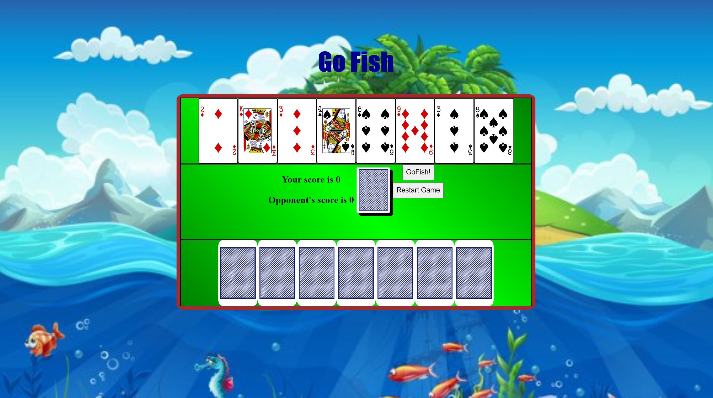

# GoFish_Project 
### GoFish README

Go Fish

### Screenshots:

Go Fish is a popular traditional simple card game where each player is dealt a number of cards, and has to guess a number from the cards in their hands to prompt the opponent with. If the opponent has one or more cards with the same number as what was asked of them, they are required to transfer those cards from their hand to the opposite players. If they do not have any cards with the number specified, they reply with 'Go Fish!' and the original player has to pick up a random card from the deck. Once a player accumulates 4 cards with the same number, they place the 4 cards down on the side and are awarded a point. A player wins when they have more cards/points than the other player either at the time the deck finishes or when a player accumulates all 52 cards.

### Technologies Used:
-Javascript ES6
-HTML 5.0
-CSS 3.0
-DOM

### Getting Started:
Below is the link to the Go Fish Game:
https://pages.git.generalassemb.ly/KareemD123/GoFish_Project/

### How to Play: 
Clicking on the card selection from your hand (the visible cards) will automatically prompt the opponent for the chosen card. If they have that number, it will automatically be added to your hand, if not, you will be alerted to 'Go Fish!', where you will be required to pick up a card from the deck by either clicking the 'Go Fish!' button or clicking on the deck. After picking up a card from the deck, you will be given another chance to choose a card from your hand to prompt the opponent. Every time you click on one of your cards to prompt the opponent, the computer will automatically begin their turn in response. Allow a few seconds for the computer to think and plan! A scoreboard will display and you will be given a victory alert once you win (if you win).

### Planned Future Enhancements: 
- Optional difficulty mode
- Animated card movements to represent score decks
- Animated background
- Games out of 3 or 5
- More Sound Effects
- Mobile-friendly User Interface
